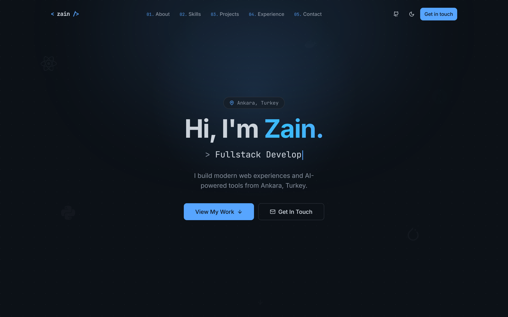
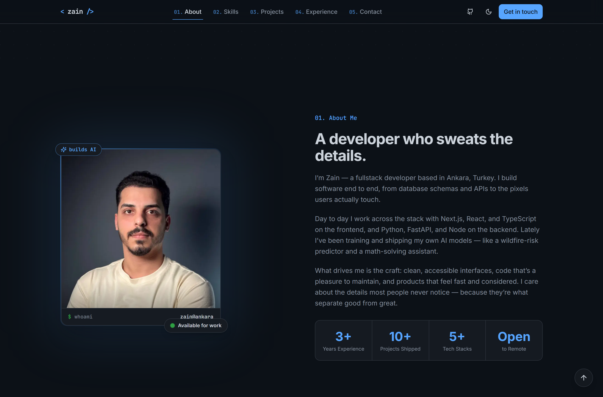
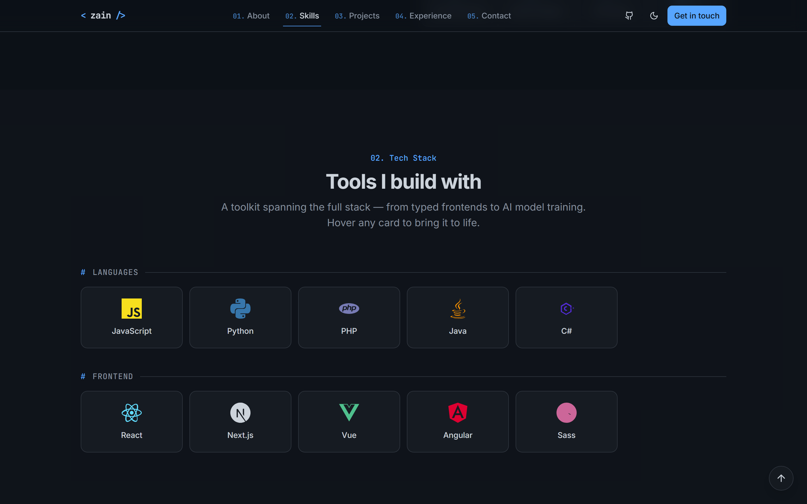
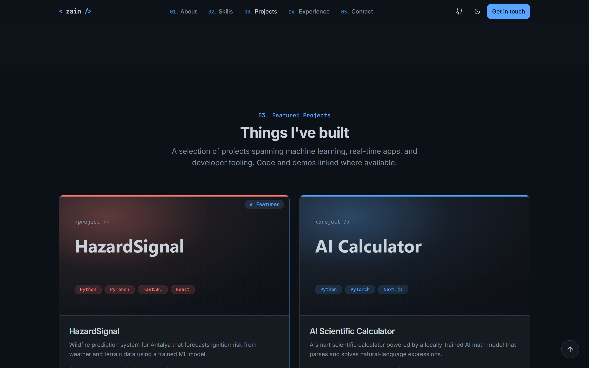

# Zain M. Al-Mawla — Portfolio

A modern, fully responsive personal portfolio with a dark **Tokyo Night** aesthetic, built as the centerpiece of my job search. Single-page, animated, accessible, and deploy-ready for Vercel.

[](https://nextjs.org/)
[](https://www.typescriptlang.org/)
[](https://tailwindcss.com/)
[](https://www.framer.com/motion/)
[](#license)

> **Live demo:** **[zain-portfolio-nu.vercel.app](https://zain-portfolio-nu.vercel.app)**

---

## Screenshots

| Hero | About |
| --- | --- |
|  |  |

| Tech Stack | Projects |
| --- | --- |
|  |  |

> Screenshots live in `docs/` and are regenerated with `python scripts/verify-ui.py`
> and `python scripts/capture-sections.py` while the dev server is running.

---

## Features

- 🎨 **Tokyo Night design system** — GitHub-dark palette (`#0D1117` / `#58A6FF`) mapped to HSL design tokens, with a working light mode.
- 🌗 **Dark / light toggle** — via `next-themes` (defaults to dark, no flash on load).
- ✨ **Tasteful motion** — Framer Motion scroll reveals, a typewriter hero, a cursor-follow gradient, and floating tech icons. All animation respects `prefers-reduced-motion`.
- 📱 **Mobile-first & responsive** — tested at 375 / 768 / 1024 / 1440px.
- 🧭 **Sticky shrinking navbar** — smooth scroll-spy navigation + a mobile menu.
- 📨 **Working contact form** — `react-hook-form` + `zod` validation, a server API route, a honeypot anti-spam field, and success/error toasts (`sonner`).
- 🔎 **SEO-ready** — full metadata, OpenGraph + Twitter cards (dynamically generated PNG), `robots.txt`, and `sitemap.xml`.
- ♿ **Accessible** — semantic landmarks, skip link, ARIA labels, visible focus rings, keyboard-friendly.
- 🧱 **Data-driven** — projects, skills, and experience live in typed `/data` files, so updating content never means touching components.
- 🚫 **404 page** that matches the site's aesthetic.

---

## Tech Stack

| Area        | Tools                                                        |
| ----------- | ----------------------------------------------------------- |
| Framework   | [Next.js 14](https://nextjs.org/) (App Router)              |
| Language    | [TypeScript](https://www.typescriptlang.org/) (strict)      |
| Styling     | [Tailwind CSS](https://tailwindcss.com/)                    |
| UI          | [shadcn/ui](https://ui.shadcn.com/)-style primitives        |
| Animation   | [Framer Motion](https://www.framer.com/motion/)             |
| Icons       | [lucide-react](https://lucide.dev/) + inline brand SVGs     |
| Theming     | [next-themes](https://github.com/pacocoursey/next-themes)   |
| Forms       | [react-hook-form](https://react-hook-form.com/) + [zod](https://zod.dev/) |
| Toasts      | [sonner](https://sonner.emilkowal.ski/)                     |
| Deployment  | [Vercel](https://vercel.com/)                               |

---

## Getting Started

### Prerequisites

- **Node.js 18.17+** (Node 20+ recommended)
- npm (or pnpm / yarn / bun)

### Setup

```bash
# 1. Clone
git clone https://github.com/zico20/zain-portfolio.git
cd zain-portfolio

# 2. Install dependencies
npm install

# 3. (Optional) configure environment variables
cp .env.example .env.local
#    The app runs fine without this — see "Environment Variables" below.

# 4. Run the dev server
npm run dev
```

Open [http://localhost:3000](http://localhost:3000).

### Scripts

| Command             | Description                          |
| ------------------- | ------------------------------------ |
| `npm run dev`       | Start the dev server                 |
| `npm run build`     | Production build                     |
| `npm run start`     | Serve the production build           |
| `npm run lint`      | Run ESLint                           |
| `npm run typecheck` | Type-check with `tsc --noEmit`       |

### Regenerating assets

Project cover images, the OG fallback, and the favicon are generated SVGs:

```bash
node scripts/generate-assets.mjs
```

---

## Project Structure

```
.
├── public/
│   ├── favicon.svg
│   ├── og.svg                  # static OG fallback (dynamic PNG is generated at /opengraph-image)
│   └── projects/               # generated project cover images
├── scripts/
│   └── generate-assets.mjs     # regenerates covers / favicon / OG
├── src/
│   ├── app/
│   │   ├── api/contact/route.ts   # contact form endpoint (validates + logs; TODO: email)
│   │   ├── globals.css            # design tokens + base styles
│   │   ├── icon.svg, apple-icon.svg
│   │   ├── layout.tsx             # root layout, fonts, SEO metadata, providers
│   │   ├── not-found.tsx          # custom 404
│   │   ├── opengraph-image.tsx    # dynamic OG card (PNG)
│   │   ├── page.tsx               # composes all sections
│   │   ├── robots.ts
│   │   └── sitemap.ts
│   ├── components/
│   │   ├── sections/              # Hero, About, Skills, Projects, Experience, Contact
│   │   ├── ui/                    # shadcn-style primitives (button, input, card, …)
│   │   ├── navbar.tsx, footer.tsx, back-to-top.tsx
│   │   ├── theme-provider.tsx, theme-toggle.tsx, toaster.tsx
│   │   ├── project-card.tsx, section.tsx, tech-icon.tsx
│   ├── data/
│   │   ├── projects.ts            # ← edit your projects here
│   │   ├── skills.ts              # ← edit your tech stack here
│   │   └── experience.ts          # ← edit your timeline here
│   ├── hooks/
│   │   └── use-typewriter.ts
│   └── lib/
│       ├── site.ts                # ← name, links, nav (single source of truth)
│       ├── contact-schema.ts      # shared zod schema (client + server)
│       ├── scroll.ts, utils.ts
├── next.config.mjs
├── tailwind.config.ts
├── tsconfig.json
└── vercel.json
```

---

## Customizing Content

Everything you'll want to edit lives in two places:

1. **`src/lib/site.ts`** — your name, role, location, tagline, email, and social links.
2. **`src/data/*.ts`** — `projects.ts`, `skills.ts`, and `experience.ts` are plain typed arrays.

To add a project, append an object to `projects` in `src/data/projects.ts` and drop a `1200×630` cover at `public/projects/<slug>.svg` (or point `image` at any file in `/public`).

---

## Environment Variables

The site runs with **no environment variables**. They only unlock optional behavior:

| Variable               | Required | Purpose                                                        |
| ---------------------- | -------- | -------------------------------------------------------------- |
| `NEXT_PUBLIC_SITE_URL` | No       | Canonical URL for metadata, OG, and sitemap. Defaults to localhost. Set it in production. |
| `RESEND_API_KEY`       | No       | To actually deliver contact emails (see below).                |
| `CONTACT_TO_EMAIL`     | No       | Destination address for contact emails.                        |

### Wiring up the contact form

Out of the box, `POST /api/contact` validates the submission and logs it server-side (in dev). To deliver real emails, follow the `TODO` in [`src/app/api/contact/route.ts`](src/app/api/contact/route.ts):

```bash
npm install resend
```

…then add `RESEND_API_KEY` + `CONTACT_TO_EMAIL` to your env and uncomment the Resend block.

---

## Deployment (Vercel)

1. Push this repo to GitHub.
2. Go to [vercel.com/new](https://vercel.com/new) and import the repository.
3. Framework preset auto-detects **Next.js** — no build config needed.
4. Add the env var `NEXT_PUBLIC_SITE_URL` (your production URL, e.g. `https://zain.dev`).
5. Deploy. 🎉

> A `vercel.json` is included with sensible security headers.

You can also deploy from the CLI:

```bash
npm i -g vercel
vercel        # preview
vercel --prod # production
```

---

## Accessibility & Performance

- Semantic HTML with one `<h1>`, ordered headings, and ARIA labels on icon-only controls.
- Skip-to-content link and visible keyboard focus styles.
- `prefers-reduced-motion` disables animations and smooth scrolling.
- Images use `next/image` with explicit dimensions and descriptive `alt` text.
- Targeted at a **95+ Lighthouse** score across Performance, Accessibility, Best Practices, and SEO.

---

## License

[MIT](https://opensource.org/licenses/MIT) © Zain M. Al-Mawla

---

<p align="center">Built with Next.js and Tailwind — from Ankara, Turkey 🇹🇷</p>
```
